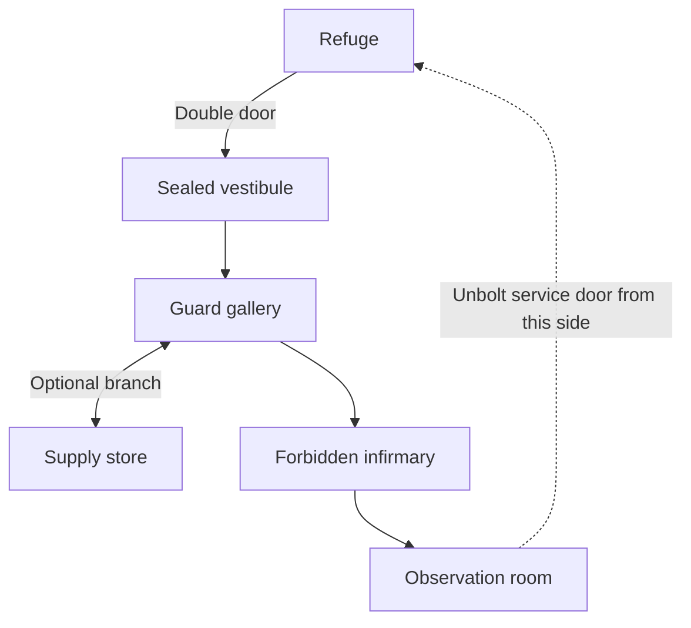

# Cendrelith — Level 01: Beyond the Seal

Status: design proposal and visual concept; not a constructed Unity scene.
Target first-play duration: 10–15 minutes, to be validated in a blockout.

## Objective

The caregiver needs medicine to stabilize someone important to the hero. The old infirmary is the only lead. Enter the sealed wing, overcome its former inhabitants, recover the remedy from the adjoining observation room and return to the refuge. The remedy buys time; it does not cure the apocalypse.

## Layout

The refuge remains at surface level. The entire first wing can be on the same elevation, with thresholds rather than staircase transitions. Place the observation room near the refuge in world space so the locked service passage makes a plausible loop.

Arrows indicate first-visit sequence, not one-way travel. The entry stays available for retreat. The return service door opens from the observation side and stays open during the run. Collecting the remedy is not required to operate the bolt; the quest requires taking it back to the caregiver.

| Room | Starting blockout footprint | Encounter / reward | Narrative |
|---|---|---|---|
| Vestibule | 12 x 10 units | No enemies; safe orientation | Dusty ledger, broken seal, dim view toward gallery |
| Guard gallery | 22 x 10 units | 1 skeleton then 2; 30 XP total | Former guards still wear the complex's insignia |
| Supply store | 8 x 8 units | 1 skeleton, 10 XP; guaranteed modest weapon upgrade | Supplies were stockpiled before the disaster |
| Infirmary | 16 x 12 units | Necromancer with 2 finite skeleton servants; 50 XP total | Treatment gave way to forbidden resurrection |
| Observation room | 10 x 8 units | Remedy, optional prophetic note, return door | Mages received warnings through divination |

Footprints are starting values, not pixel-perfect measurements from the painting. Corridors start at 3–4 units wide. Scale against the actual player collider and camera during blockout. Gallery spans multiple camera views; the complete expedition is never visible in one frame.

## Combat and progression

With current prototype thresholds (30 then 60 XP), the first three skeletons reach level 2. Each skeleton grants 10 XP; necromancer reward is proposed at 30 XP. Main route grants 80 XP total (level 2, 50/60); optional store brings total to 90 (level 3, 0/90). These values require authoring on the enemies; they have not been applied to the scene.

Necromancer encounter starts with two servants. No unlimited summons in MVP. Its attack needs a visible wind-up and room to dodge, with cover that doesn't trap the player. Retreat remains possible. The optional upgrade helps but must not be required to win. Tune the main route using the starting weapon too.

## Visual rules

- Reuse existing stone floor family. Avoid broad clutter piles across the walkable center.
- Warm amber leaks through the refuge door; colder greys guide the player further inside.
- Vestibule: bench, ledger, clerk's desk, extinguished candles, subtle mage emblem. No major gore reveal yet.
- Infirmary: reuse the wooden bed excluded from the refuge, treatment table, restraints and old stains.
- No enemy health bars, no hotbar. Hit response and death animation communicate damage.
- The generated vestibule image is a mood/composition reference, not a modular floor texture or playable map.

## Build order / acceptance

1. Block out rooms and connections using plain shapes; test navigation and camera occlusion.
2. Validate combat with current player speed/range, and both retreat routes.
3. Add optional guaranteed loot and equip interaction.
4. Add caregiver quest, remedy pickup/return and observation note.
5. Dress rooms using the approved materials and separate reusable props.

Success: player can leave refuge, fight, level up, optionally equip better loot, recover remedy, open shortcut and complete the quest without restarting or becoming trapped. Death/restart must reset quest and doors consistently until proper world-state saving is implemented.
